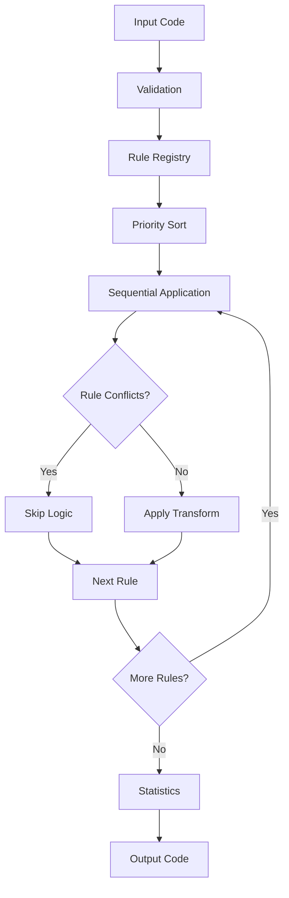

# Selenium to Playwright Converter

A CLI tool that converts Selenium WebDriver TypeScript tests to Playwright format.

> **Note**: This tool was generated using AI assistance to automate common conversion patterns. Manual review of converted code is required.

## Features

- Converts common Selenium patterns to Playwright equivalents
- Adds TODO comments for patterns requiring manual review
- Processes single files or directories
- Provides dry-run mode for previewing changes
- Built with TypeScript

## Installation

### Global Installation
```bash
npm install -g selenium-playwright-converter
```

### Local Development
```bash
git clone https://github.com/neilfitzgerald1972/selenium-playwright-converter-ts.git
cd selenium-playwright-converter-ts
npm install
npm run build
npm link  # Makes CLI available globally
```

## Usage

### Basic Commands

Convert a single file:
```bash
sel2pw login-test.ts
# or
selenium-to-playwright login-test.ts
# Creates: login-test.playwright.ts
```

Convert with custom output:
```bash
sel2pw login-test.ts my-playwright-test.ts
```

Convert entire directory:
```bash
sel2pw ./selenium-tests ./playwright-tests
```

### Options

Preview without writing files:
```bash
sel2pw dir ./tests --dry-run
```

Verbose output:
```bash
sel2pw file login-test.ts --verbose
```

## Conversion Coverage

### Automatically Converted
- Import statements (WebDriver → Playwright)
- Driver initialization (Builder → browser.launch())
- Navigation methods (get, navigate, refresh)
- Element locators (By.* → page.locator())
- Basic interactions (click, sendKeys → fill, click)
- Wait conditions (WebDriverWait → waitFor)
- Screenshots and page information
- JavaScript execution (executeScript → evaluate)
- Keyboard actions (Keys → keyboard.press)
- Mouse actions (Actions → mouse events)
- Browser management (quit → close)
- Cookie operations (manage().cookies → context.cookies)
- Page state checks (isDisplayed → isVisible)
- Network interception setup
- Mobile device emulation
- Performance logging
- Touch gestures
- Geolocation and permissions
- Pause/sleep conversions

### Requires Manual Review (TODO Comments Added)
- Complex wait conditions with custom logic
- Multi-window/tab handling with complex switching
- Frame operations with dynamic frame detection
- Alert/dialog handling with custom validation
- Advanced action chains with timing
- Select dropdown edge cases
- File upload/download operations
- Complex JavaScript execution patterns
- Advanced keyboard combinations
- Window management with size/position
- Network request/response modification
- Custom mobile device configurations
- Performance metrics collection
- Advanced touch gesture sequences

## Example Output

**Input (Selenium):**
```typescript
import { Builder, By, WebDriver } from 'selenium-webdriver';

const driver: WebDriver = new Builder().forBrowser('chrome').build();
await driver.get('https://example.com');
const element = await driver.findElement(By.id('username'));
await element.sendKeys('testuser');
await element.click();
await driver.quit();
```

**Output (Playwright):**
```typescript
import { test, expect, chromium } from '@playwright/test';

const browser = await chromium.launch();
const context = await browser.newContext();
const page = await context.newPage();
await page.goto('https://example.com');
const element = page.locator('#username');
await element.fill('testuser');
await element.click();
await browser.close();
```

## Development

### Setup
```bash
npm install
npm run build
```

### Testing

This project uses Jest for testing. The tests are organized by functionality:

- `browser-init.test.ts` - Browser initialization conversions
- `element-finding.test.ts` - Element locator conversions
- `element-interaction.test.ts` - Click, fill, and interaction conversions
- `waits-conditions.test.ts` - Wait and condition conversions
- `advanced-interactions.test.ts` - Complex gesture conversions
- `keyboard-conversions.test.ts` - Keyboard input conversions
- `mouse-actions.test.ts` - Mouse action conversions
- `navigation.test.ts` - Page navigation conversions
- `screenshots-pageinfo.test.ts` - Screenshot and page info conversions
- `frames-windows.test.ts` - Frame and window management
- `cli.test.ts` - CLI interface testing
- `cookie-conversions.test.ts` - Cookie management conversions
- `dialog-handling.test.ts` - Alert and dialog conversions
- `drag-and-drop.test.ts` - Drag and drop interactions
- `file-operations.test.ts` - File upload/download operations
- `javascript-execution.test.ts` - Script execution conversions
- `mobile-emulation.test.ts` - Mobile device emulation
- `network-interception.test.ts` - Network request handling
- `performance-logging.test.ts` - Performance metrics
- `touch-conversions.test.ts` - Touch gesture conversions
- `window-management.test.ts` - Window and tab management
- `geolocation-permissions.test.ts` - Geolocation and permissions
- `pause-conversions.test.ts` - Sleep and pause conversions
- `element-state.test.ts` - Element state checking
- `special-characters.test.ts` - Special character handling
- `convert-send-keys.test.ts` - SendKeys conversion testing
- `keyboard-conversion-*.test.ts` - Keyboard conversion edge cases
- `errors.test.ts` - Error handling
- `string-utils.test.ts` - String utility functions

### Development Commands

Build the project:
```bash
npm run build
```

Run in development mode:
```bash
npm run dev
```

Lint and format code:
```bash
npm run lint
npm run format
npm run type-check
```

### Running Tests

Run all tests:
```bash
npm test
```

Run tests in watch mode:
```bash
npm run test:watch
```

Run tests with coverage:
```bash
npm run test:coverage
```

Run a specific test file:
```bash
npx jest tests/element-finding.test.ts
```

## Architecture

### Core Design

The converter uses a **rule-based transformation engine** with priority-ordered pattern matching:

1. **Rule Registry** (`src/conversions/index.ts`)
   - Central repository of 28+ conversion modules
   - Priority-based execution (1000+ → 1) 
   - Modular organization by feature area

2. **Conversion Engine** (`src/converter.ts`)
   - Sequential rule application
   - Statistics tracking and validation
   - Error handling and reporting

3. **Pattern Matching System**
   - Regex-based pattern detection
   - String/function-based replacements
   - Context-aware transformations

### Rule Categories & Priorities

```
🔥 Selenium 4 Modern (1000+)     - Latest Selenium features
🔥 Playwright Modern (1000+)     - Modern Playwright 2024+ features  
🔶 Browser Init (100-999)        - WebDriver → browser.launch()
🔶 Core Conversions (50-999)     - Elements, waits, interactions
🔵 Advanced Features (10-99)     - Complex patterns, edge cases
🔵 Basic Patterns (1-49)         - Simple transformations
```

### Rule Interference Problem ⚠️

**Critical Issue**: Multiple rules can apply to the same code pattern, causing malformed output.

**Example Problem:**
```typescript
// Basic rule converts:
driver.manage().addCookie({...}) → await page.context().addCookies([{...}])

// Enhanced rule then converts:
page.context().addCookies([{...}]) → // Enhanced features + malformed syntax
```

**Solution Strategies:**

1. **Priority Ordering**: Higher priority rules run first
2. **Skip Logic**: Rules check if pattern was already processed
3. **Pattern Specificity**: Narrow patterns to avoid conflicts
4. **Negative Lookbehinds**: Exclude already-converted patterns

**Current Safeguards:**
- Priority-based execution order
- Context-aware skip conditions
- Specific pattern matching (avoid broad regex)
- Comprehensive test coverage to detect interference

### Conversion Flow



## Troubleshooting

### Common Issues

**1. Rule Interference - Malformed Output**
```typescript
// Problem: Double transformations
await // Enhanced features
await page.context().addCookies([
  { { name: "test" }, partitionKey: '...' }
]);
```
**Solution**: This indicates rule interference. Report as a bug with the input code.

**2. Incomplete Conversions**
```typescript
// Some patterns may not be converted
driver.manage().window().setSize(1920, 1080);  // TODO comment added
```
**Solution**: Manual conversion required. Check TODO comments for guidance.

**3. Complex Selenium Patterns**
```typescript
// Advanced patterns may need restructuring
const actions = new Actions(driver);
await actions.moveToElement(element).click().build().perform();
```
**Solution**: Consider using Playwright's simpler API or multiple operations.

### Getting Help

- Check the [Issues](https://github.com/neilfitzgerald1972/selenium-playwright-converter-ts/issues) page
- Review TODO comments in converted code
- Use `--dry-run` to preview conversions before applying
- Test converted code thoroughly before production use

## Important Notes

- This tool handles common conversion patterns but does not guarantee complete compatibility
- All converted code requires testing and review
- TODO comments indicate areas needing manual attention
- Complex Selenium patterns may need significant refactoring
- **Rule interference** can occur - always test converted code thoroughly
- Consider using Playwright's built-in code generation (`npx playwright codegen`) for new tests

## Repository

- **GitHub**: https://github.com/neilfitzgerald1972/selenium-playwright-converter-ts
- **Issues**: https://github.com/neilfitzgerald1972/selenium-playwright-converter-ts/issues
- **NPM**: https://www.npmjs.com/package/selenium-playwright-converter

## Contributing

Contributions are welcome! Please read our [Contributing Guide](CONTRIBUTING.md) and [Code of Conduct](CODE_OF_CONDUCT.md) before submitting pull requests.

## Security

For security issues, please see our [Security Policy](SECURITY.md).

## Project Structure

```
selenium-playwright-converter-ts/
├── src/
│   ├── cli.ts              # CLI interface
│   ├── converter.ts        # Main conversion engine
│   ├── types.ts            # TypeScript interfaces
│   ├── conversions/        # Conversion rules by category
│   │   ├── index.ts        # Central rule registry
│   │   ├── browser-init-conversions.ts
│   │   ├── element-finding-conversions.ts
│   │   ├── element-interaction-conversions.ts
│   │   ├── wait-conversions.ts
│   │   ├── navigation-conversions.ts
│   │   ├── screenshot-conversions.ts
│   │   ├── advanced-interactions.ts
│   │   ├── javascript-execution-conversions.ts
│   │   ├── keyboard-conversions.ts
│   │   ├── mouse-conversions.ts
│   │   ├── mobile-emulation-conversions.ts
│   │   ├── network-conversions.ts
│   │   ├── cookie-conversions.ts
│   │   ├── dialog-handling-conversions.ts
│   │   ├── file-handling-conversions.ts
│   │   ├── window-management-conversions.ts
│   │   ├── geolocation-permissions-conversions.ts
│   │   ├── performance-logging-conversions.ts
│   │   ├── touch-conversions.ts
│   │   ├── pause-conversions.ts
│   │   └── page-state-conversions.ts
│   └── utils/
│       ├── errors.ts       # Custom error types
│       ├── key-mappings.ts # Keyboard key mappings
│       └── string-utils.ts # String utility functions
├── tests/                  # Comprehensive test suite
├── dist/                   # Built files
├── coverage/               # Test coverage reports
├── .github/                # GitHub Actions CI/CD
├── .husky/                 # Git hooks
├── .vscode/                # VS Code configuration
├── package.json
├── tsconfig.json
├── jest.config.ts
├── eslintrc.json
├── CLAUDE.md               # Claude Code instructions
└── README.md
```

## License

MIT License